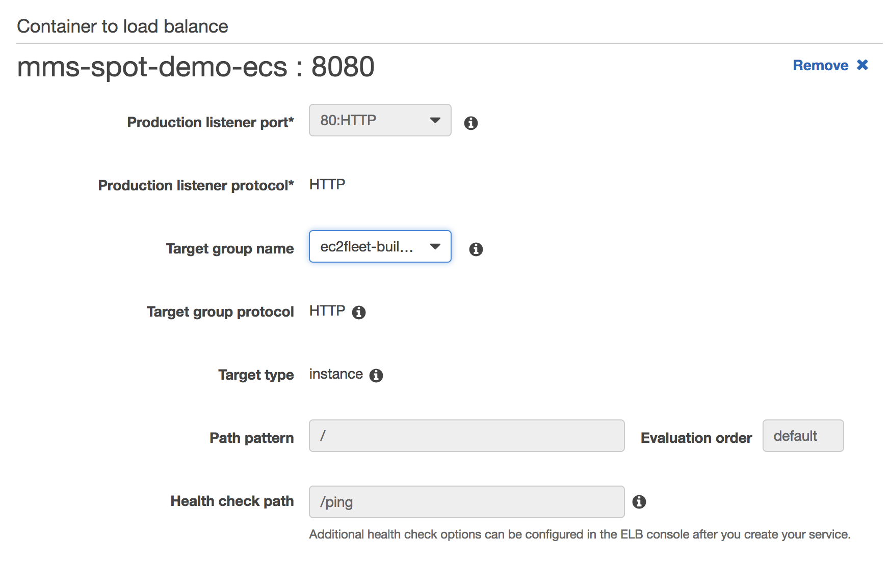
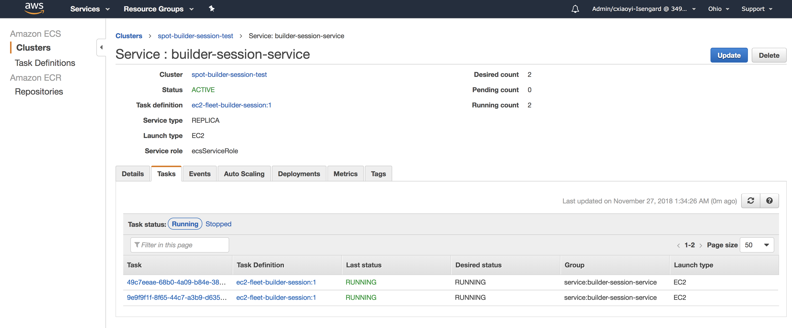
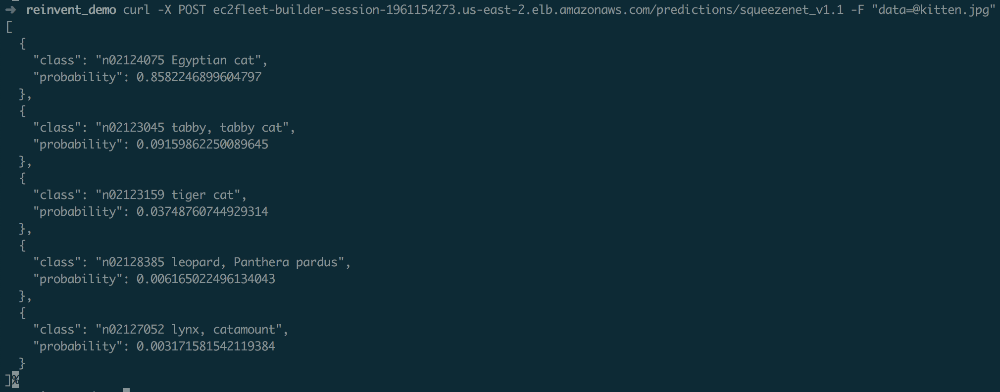
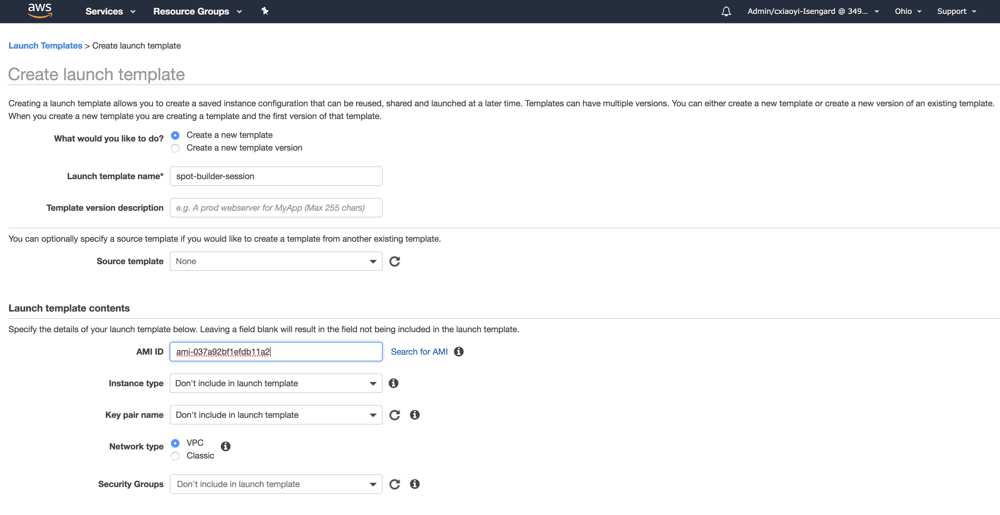
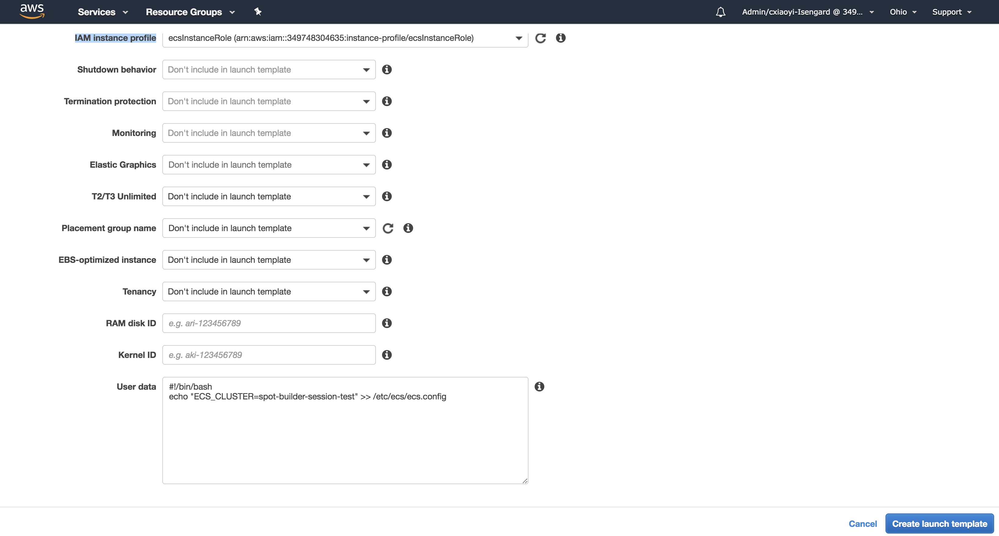

# Building High-Scale Web Apps on Amazon EC2 Fleet

*Welcome to this builder session!*

We are going to deploy an image classifier using deep learning model(SqueezeNet), Model Server for Apache MXNet and Amazon ECS on top of Amazon EC2 Fleet and Amazon EC2 AutoScaling. One of the fun things are, that the [Amazon EC2 Spot Instances](https://aws.amazon.com/ec2/spot/) we are using is at savings of up to 90% the On-Demand price.

***Prerequisites***:

* To complete this builder session, you need access to an AWS account with administrative permissions. An IAM user with administrator access (arn:aws:iam::aws:policy/AdministratorAccess) will do nicely. [More information](https://aws.amazon.com/premiumsupport/knowledge-center/create-and-activate-aws-account/)
* [AWS CLI configuration](https://docs.aws.amazon.com/cli/latest/userguide/cli-chap-getting-started.html)

***Notes***:

* The console links provided throughout the demo are in US East(Ohio, us-east-2).

***Table of contents***:
   * [Building High-Scale Web Apps on Amazon EC2 Fleet](#building-high-scale-web-apps-on-amazon-ec2-fleet)
      * [1. Create Amazon ECS Cluster](#1-create-amazon-ecs-cluster)
      * [2. Create ECS task definition for MXNet Model Server](#2-create-ecs-task-definition-for-mxnet-model-server)
      * [3. Create Elastic Load Balancer](#3-create-elastic-load-balancer)
      * [4. Deploy the service](#4-deploy-the-service)
      * [5. Test](#5-test)
      * [6. Scale the Amazon ECS Cluster](#6-scale-the-amazon-ecs-cluster)
      * [Summary](#summary)
## 1. Create Amazon ECS Cluster

Amazon Elastic Container Service[(Amazon ECS](https://aws.amazon.com/ecs/)) is a highly scalable, high-performance container orchestration service that supports Docker containers and allows you to easily run and scale containerized applications on AWS. 

Please create cluster with two EC2 Spot instances in [ECS Console](https://us-east-2.console.aws.amazon.com/ecs/home?region=us-east-2#/clusters). Please don't worry that we only launch two instances, we are going to add an [EC2 AutoScaling Group](https://docs.aws.amazon.com/autoscaling/ec2/userguide/AutoScalingGroup.html) in a moment. This is to demonstrate multiple ways to launch EC2 Spot instances for scalable web apps. 

1.1 Please choose EC2 Linux + Networking


1.2 Please select *Spot* for Provisioning Model and EC2 Instance Types. Please also select a key pair, so we can SSH into the EC2 instances for debugging.


1.3 Please add a third subnet to the VPC for the advantage of diversification across multiple availability zones to achieve high availability


1.4 Please click 'Create', then ECS will create VPC, subnets, and one instances for the cluster.

## 2. Create ECS task definition for MXNet Model Server

Please open up terminal and download the *ecs_task_definition.json* file from this repo. Then, let's execute following command to create ECS task definition. Model Server for Apache MXNet (MMS) is a flexible and easy to use tool for serving deep learning models exported from [MXNet](http://mxnet.io/) or the Open Neural Network Exchange ([ONNX](http://onnx.ai/)).
[More information about MXNet Model Server](https://github.com/awslabs/mxnet-model-server).

```
aws ecs register-task-definition --cli-input-json file://ecs_task_definiton.json --region us-east-2
```

After this command successfully finishes, let's check the created ECS task definition in the [ECS console](https://us-east-2.console.aws.amazon.com/ecs/home?region=us-east-2#/taskDefinitions).  


## 3. Create Elastic Load Balancer

Please go to the load balancer [ELB console](https://us-east-2.console.aws.amazon.com/ec2/v2/home?region=us-east-2#LoadBalancers:), and click *Create Load Balancer*.

3.1 Please choose the *Application Loader Balancer*.


3.2 Please choose the VPC that ECS created earlier for us, and select all the subnets available.


3.3 Please click through the wizard, and create a *Target Group* for routing.


3.4 After the ELB creation succeed, please note down the DNS name for testing later.


## 4. Deploy the service

4.1 Please go to the [ECS console](https://us-east-2.console.aws.amazon.com/ecs/home?region=us-east-2#/taskDefinitions/ec2-fleet-builder-session/1), select the task definition that we created earlier, and click *Create Service*.


4.2 Please choose the ECS Cluster that we created earlier, and *Launch Type* as *EC2*.


4.3 In the next step, please choose *Load balancer type* as *Application Load Balancer*, and select the LB created earlier.



4.4 After you created the ECS service, we can check the service status by clicking *View Service*. You would see the ECS tasks running in the *Tasks* tab.



## 5. Test

5.1 Please go the [ELB console](https://us-east-2.console.aws.amazon.com/ec2/v2/home?region=us-east-2#LoadBalancers:), and copy the *DNS name* if you need it.


5.2 Let's test with ping first.

```
curl ec2fleet-builder-session-1961154273.us-east-2.elb.amazonaws.com/ping
```


5.3 Let's test with the a sample image. 

```
Cat 3: curl -o kitten.jpg https://s3.amazonaws.com/model-server/inputs/kitten.jpg
curl -X POST ec2fleet-builder-session-1961154273.us-east-2.elb.amazonaws.com/predictions/squeezenet_v1.1 -F "data=@kitten.jpg"
```




## 6. Scale the Amazon ECS Cluster

6.1 Create Launch template with User Data

We need the instances launched to automatically register with the ECS cluster we created. When you launch an Amazon ECS container instance, you have the option of passing user data to the instance. The data can be used to perform common automated configuration tasks and even run scripts when the instance boots. For Amazon ECS, the most common use cases for user data are to pass configuration information to the Docker daemon and the Amazon ECS container agent. [Please visit EC2 LaunchTemplate Console](https://us-east-2.console.aws.amazon.com/ec2/v2/home?region=us-east-2#CreateTemplate:).

6.1.1 You will need the ECS optimized AMI id from [here](https://docs.aws.amazon.com/AmazonECS/latest/developerguide/launch_container_instance.html). Also, please make sure you use the same security group that created for ECS cluster.



6.1.2 Please expand *Advanced details* tab and go to *User data* section. Please choose the *IAM instance profile* for ECS cluster and add *User data*.

```
#!/bin/bash
echo ECS_CLUSTER=your_cluster_name >> /etc/ecs/ecs.config
```


6.2 Launching Amazon ECS Container Instances using EC2 AutoScaling

Please go to the [EC2 Console](https://us-east-2.console.aws.amazon.com/ec2), and open the *Auto Scaling Group* tab, then click *Create Auto Scaling Group*


Next step we are going to use [EC2 Auto Scaling Groups With Multiple Instance Types & Purchase Options](https://aws.amazon.com/blogs/aws/new-ec2-auto-scaling-groups-with-multiple-instance-types-purchase-options/)


6.3 Check ECS instances registration

Please go to [ECS Console](https://us-east-2.console.aws.amazon.com/ecs), and click on the cluster we created earlier. Then click *ECS Instances* tab, you should see instances from EC2 AutoScaling group showing up here.


6.4 Load test

```
ab -c 200 -n 20000 -T 'image/jpeg' -p kitten.jpg ec2fleet-builder-session-1961154273.us-east-2.elb.amazonaws.com/predictions/squeezenet_v1.1
```

## Summary

In this session, you have successfully deployed an image classifier on EC2 Fleet using EC2 AutoScaling with multiple EC2 instance types & purchase options, and the EC2 instances are at savings of up to 90% the On-Demand price. 

Please complete the session survey in the mobile app. Thank you for attending this session!

You can further explore this topic with following links.

[1] [EC2 AutoScaling purchase options](https://docs.aws.amazon.com/autoscaling/ec2/userguide/AutoScalingGroup.html#asg-purchase-options)

[2] [EC2 Fleet](https://aws.amazon.com/blogs/aws/ec2-fleet-manage-thousands-of-on-demand-and-spot-instances-with-one-request/)

[3] [More models to try out at MXNet model zoo](https://github.com/awslabs/mxnet-model-server/blob/master/docs/model_zoo.md)

[4] [Another model server - TensorFlow serving](https://docs.aws.amazon.com/dlami/latest/devguide/tutorial-tfserving.html)

[5] [SqueezeNet](https://arxiv.org/abs/1602.07360)